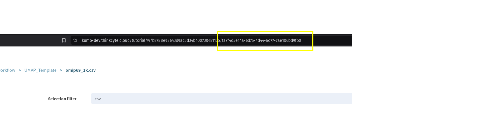

## WebApp Creation Tutorial

WebApp are bespoke user interfaces built on top of Tercen's flexible analysis capabilities. These UI's provide a way to group or grant easy access to common use cases, increasing productivity and reducing user training time.

This tutorial will guide in the creation of your first WebApp: the **UMAP report app**. We will start by covering the use case, briefly how this is achieved typically in Tercen and how the WebApp can change the way the user interacts with Tercen.

#### SUMMARY 

* [1. Tutorial Overview](#1-tutorial-overview)  
  * [1.1. Library Requirements](#11-library-requirements)  
* [2. Running the Analysis Without the WebApp](#2-running-the-analysis-without-webapp)
  * [2.1. Scaling](#21-scaling)
* [3. Developing a WebApp](#3-developing-a-webapp)  
  * [3.1. Repository Setup](#31-repository-setup)
    * [3.1.1. Overview of the WebApp Project Files](#311-overview-of-the-webapp-project-files)
    * [3.1.2. Tercen Components](#312-tercen-components)
  * [3.2. Running the WebApp](#32-running-the-webapp)
    * [3.2.1. Running the WebApp from VSCode](#321-running-the-webapp-from-vs-code)
  * [3.3. The Upload Data Screeb](#33-the-upload-data-screen)
    * [3.3.1. Linking a WebApp to a Workflow Template](#331-linking-a-webapp-to-a-workflow-template)
    * [3.3.2. Adding the ActionComponent](#332-adding-the-actioncomponent)
    * [3.3.3. The WorkflowRunner](#333-the-workflowrunner)
  * [3.4. The Report Screen](#34-the-report-screen)
* [4. Conclusion](#4-conclusion)


### 1. Tutorial Overview

##### 1.1. Library Requirements

A detailed overview on how to import <code>Workflow</code> GitHub repositories is described in [this video](https://www.youtube.com/watch?v=JaFlgRekJP8). Briefly, we want to create a **project from Git** in a library team. In this tutorial, we will need to import [the example UMAP workflow, version 0.0.3](https://github.com/tercen/webapp_tutorial_workflow) into our library.

This workflow has 3 main features:

1. The table step to which we will link our sample data. We then convert the table from wide to long format usin the <code>Gather</code> step.
2. We then have two analysis steps: <code>Run UMAP</code> and <code>Clustering</code>.
3. Finally, we have two visualizations of the analysis. <code>Plot Cluster</code> exports the UMAP results colored by the <code>Clustering</code> results, whereas the <code>Plot</code> exports the marker value-coded UMAP coordinates.

<p>
<center></center>
<center><em>Workflow used in the tutorial.</em></center>
</p>

Go to the installed project and download the <code>omip69_1k.csv</code> file to a folder of your choice.

### 2. Running the Analysis without WebApp

If you already know how to do all steps in Tercen, you can skip straight to [section 3](#3-developing-a-webapp), otherwise let's see how to do this. You can also refer to the [Developer's Guide](https://tercen.com/explore) for a detailed view on how to take advantage of Tercen's full functionality.

Before diving into the WebApp creation, let's see our workflow in action. Create a new Project. Inside this project, create a Workflow from teh Template we just imported. Go into the workflow and press the 'Run All' button and select the OMIP data and press 'Ok'.

<p>
<center></center>
<center><em>Running the Workflow. First press Run All, then select the data.</em></center>
</p>

After a few moments, the process will finish and we can inspect the images produced. Afterwards, we can open the <code>Report</code> side-view and visualize or download the produced images.


##### 2.1. Scaling

If we want to keep every workflow thas has ever been run in a project -- and the generated images -- we would need to execute these steps for every new dataset we want to analyze. That is fine if we don't do that very often. In a scenario of multiple runs per day, or multiple users, the overhead can become noticeable.

One solution to this overhead is to do as much as possible inside the operator. Fore more complex analyses, this can make workflows harder to understand and to audit in the long run.

A second solution is to develop an UI handles a lot of functionality "behid the scenes", leaving the users free to focus on the analyses and results. That is exactly what WebApps do.


### 3. Developing a WebApp

WebApps are a way to provide users with a custom interaction with Tercen core functionality, automating and streamlining certain tasks. Our goal here is to build a WebApp that will allow users to more quickly execute the interactivity steps described in [section 2](#2-running-the-analysis-without-webapp).

**NOTE:** This tutorial assumes that the Flutter SDK is correctly installed.

**NOTE 2:** We use VS Code as the development environment in this tutorial. 

##### 3.1. Repository Setup

The first step is to create a Github repository that will contain our WebApp code. Tercen provides a template for that. Select the <code>tercen/webapp_template</code> template, set the new repository to public and click on <code>Create repository</code>.
<p>
</br>
<em>Repository creation. Select <code>tercen/webapp_template</code> as the template (1). Although private repositories are supported, for the sake of simplicity, we will create a public one for this tutorial (2).</em>
</p>

Next, clone the project and in its root project run <code>flutter pub get</code> to ensure that all dependencies are satisfied.

###### 3.1.1. Overview of the WebApp project files

The project comes with a number of folders and files that we will become familiar as the tutorial goes on. For now, it suffices to know that we will create our screens under the <code>lib/screens</code> folder and register them in the <code>main.dart</code> file. 

<p>
</br>
<em>File structure of a recently created WebApp project.</em>
</p>

###### 3.1.2. Tercen Components

Tercen provides a [webapp development library](https://github.com/tercen/webapp_lib). It contains a number of functions to interact with Workflows, Projects and Users. It also wraps commonly used Widget in what we call **Components**.

**Components** have two main roles:
1. Provide reusable code so it becomes easy to add Widgets like text input or tables to your screens.

2. Integrates these Widgets with the overall WebApp architecture, automatically handling layout placement, state saving and providing a framework for interaction with the data layer.


##### 3.2. Running the WebApp

Before creating new screens, let's first see how do we run our WebApp. The standard method of running a WebApp is by pressing the **Run** button after installing the WebApp in the library. Before doing that, however, we need to build the project.

In the root folder of the project, run the <code>flutter build web</code> command. One this is done, go into the **build/web** folder and open the <code>index.html</code>. Remove the <code>\<base href="/"\></code> line. This line interferes with how Tercen serves up WebApp pages, so if it is not removed, your WebApp will not be displayed.

<p>
</br>
<em>Line to be removed before commiting the build to Github.</em>
</p>

Push the build changes to Github and install the WebApp as you would install any operator.

###### 3.2.1. Running the WebApp from VS-Code

Testing a deployed version of your WebApp is the best way to ensure all its functionalities work as expected. However, it is also possible to run your WebApp directly from VS-Code, without synchronizing with GitHub.  

_Requirements_

To run a WebApp from VSCode, we need a local running instance of Tercen. The procedure to do so is described [here](https://tercen.github.io/developers_guide/setting-up-tercen-studio.html).


_Project Setup_

Now create an empty workflow in a project. You can create it in any project and even change project later. Once you have the workflow, do these steps in order.

1. Create a <code>TableStep</code>. When you are asked about the data, press <code>Cancel</code>.

2. Create a <code>DataStep</code> linked to the previous Step. Set you WebApp as the operator.

3. In the tab to the right of Settings, set the value of <code>webapp.uri</code> to http://127.0.0.1:12888

4. Delete the <code>TableStep</code> and save the workflow.

You will end up with a workflow consisting of a single <code>DataStep</code>.

_Running Within VS-Code_

Back in our WebApp project within VSCode, we need to tell flutter to run our WebAbb and serve it in the URL in just passed to Tercen, in the project we created. In a terminal, run the following command:

```bash 
flutter run  --web-hostname 127.0.0.1 --web-port 12888 -d web-server \
    --dart-define PROJECT_ID=YOUR_PROJECT_ID
```

Once it is running, you can go back to the workflwo we previously created and run the <code>DataStep</code>. Tercen will look for the WebbApp in the <code>webapp.uri</code> we previously defined. 

_Remarks_

Running your WebApp this way is a great way to iterate changes faster, as you gain access to hot-relaoding and doesn't need to rebuild and sync your code to see code changes.

The downside, however, is that the WebApp runs within an iframe. Layout and some functions might run slightly different to deal with CORS features. It is important to periodically test the deployed version to ensure it behaves as expected.


##### 3.3. The Upload Data Screen

_The Upload Screen Screen_

The first functionality we want to add to our Web App is the ability to upload tables into our project using a Tercen component. Let's create a file called <code>lib/screens/upload_data_screen.dart</code> containing the code from <code>base_screen_snippet.dart</code>. 

```dart
import 'package:flutter/material.dart';

import 'package:webapp_components/screens/screen_base.dart';
import 'package:webapp_components/action_components/button_component.dart';
import 'package:webapp_components/components/upload_table_component.dart';
import 'package:webapp_template/webapp_data.dart';
import 'package:webapp_model/webapp_data_base.dart';

import 'package:webapp_ui_commons/mixin/progress_log.dart';
import 'package:webapp_components/abstract/multi_value_component.dart';
import 'package:webapp_workflow/runners/workflow_runner.dart';


class UploadDataScreen extends StatefulWidget {
  final WebAppData modelLayer;
  const UploadDataScreen(this.modelLayer, {super.key});

  @override
  State<UploadDataScreen> createState() => _UploadDataScreenState();
}

class _UploadDataScreenState extends State<UploadDataScreen>
    with ScreenBase, ProgressDialog {
  @override
  String getScreenId() {
    return "UploadDataScreen";
  }

  @override
  void dispose() {
    super.dispose();
    disposeScreen();
  }

  @override
  void refresh() {
    setState(() {});
  }

  @override
  void initState() {
    super.initState();
    // ....

    // Component code goes here

    // ...
    initScreen(widget.modelLayer as WebAppDataBase);
  }

  @override
  Widget build(BuildContext context) {
    return buildComponents(context);
  }
}

```

Then, we insert the components we want to see on our screen. In this case, we simply need the <code>UploadTableComponent</code>.

```dart
    var uploadComponent = UploadTableComponent("uploadComp", getScreenId(), 
      "Upload Files", widget.modelLayer.app.projectId, widget.modelLayer.app.teamname);


    addComponent("default", uploadComponent);
```

That's all we need for the screen. Now, we just need to have a navigation entry to reach it. To do that, we simply point to our screen near the end of the function.


_Navigation Menu Entry_

We add the navigation in the <code>initState</code> function of <code>main.dart</code> file. 


```dart
    //The project screen
    app.addNavigationPage(
          "Project", ProjectScreen(appData, key: app.getKey("Project")));
    
    // Our new Upload Data Screen goes here!
    app.addNavigationPage(
          "Data Upload", UploadDataScreen(appData, key: app.getKey("UploadData")));
```

And that's it. We are ready to see our screen in action. We can now rebuild the project and check how it looks in action. Don't forget to remove the **base** tag from the <code>index.html</code> file before committing the changes.

###### 3.3.1. Linking a WebApp to a Workflow Template

We are going to add a different type of component to our screen: an <code>ActionComponent</code>. The <code>ActionComponent</code> adds a button that can invoke asynchronous computations. In our case, we want to run the <code>Workflow</code> we imported in [section 2.1](#21-project-setup).

_Configuring the Workflow in the WebApp_

The WebApp needs a to know how it can access workflow templates from the library. Create a new file called <code>repos.json</code> under the <code>assets</code> folder and copy the following into it:

```JSON
{
    "repos":[
        {
            "iid":"umap_workflow",
            "name":"UMAP Workflow",
            "url":"https://github.com/tercen/webapp_tutorial_workflow",
            "version":"0.0.3"
        }
    ]
}
```
Next, we tell the WebApp to load this information. First, we add this file to Flutter's pubspec file so it is loaded.

```YAML
flutter:
  uses-material-design: true

  assets:
    - assets/img/logo.png
    - assets/img/wait.webp
    - assets/repos.json
```

Finally, we read this information into the WebApp during initialization in the <code>main.dart</code> file. In the <code>initSession</code> function, we update the <code>appData.init</code> function call from

```dart
await appData.init(app.projectId, app.projectName, app.username);
```
to

```dart
await appData.init(app.projectId, app.projectName, app.username, 
    reposJsonPath:"assets/repos.json");
```

_Adding the ActionComponent_

We are ready to add a button in our screen that will run this <code>Workflow</code>.

###### 3.3.2. Adding the ActionComponent

Adding an <code>ActionComponent</code> to a screen is similar to a adding a standard <code>Component</code>. We create a <code>ButtonActionComponent</code> in the <code>init</code> function of our upload screen and add it to the action component list handled by the <code>ScreenBase</code>.

```dart
var runWorkflowBtn = ButtonActionComponent(
    "runWorkflow", "Run Analysis", _runUmap);

addActionComponent( runWorkflowBtn);

initScreen(widget.modelLayer as WebAppDataBase);
```

The <code>ButtonActionComponent</code> requires an ID, a label and the asynchronous function that will be called when the button is clicked. 

```dart
Future<void> _runUmap() async {
    
}
```

###### 3.3.3. The WorkflowRunner

The <code>Workflow</code> system in Tercen is powerful and highly flexible. The <code>WorkflowRunner</code> is a utility layer which handles the most common interactions a WebApp has with <code>Workflows</code>. Let's see step-by-step what we need to run our UMAP <code>Workflow</code>.

_Getting the Input Data_

We start by grabbing the data we uploaded from the <code>UploadTableComponent</code>. The <code>ScreenBase</code> provides a <code>getComponent</code> method that retrieves a <code>Component</code> based on its ID. Since we can upload multiple files at once, our component is a <code>MultiValueComponent</code>.

```dart
openDialog(context);
log("Running Workflow, please wait.");
var filesComponent = getComponent("uploadComp", groupId: getScreenId()) 
      as MultiValueComponent;

var uploadedFiles = filesComponent.getValue();

for( var uploadedFile in uploadedFiles ){
    // Setup and run the workflow
    
    // ...
}
closeLog();
```

The <code>getValue</code> function returns a list of <code>IdElement</code> objects, containing the uploaded files' id and name.

_Configuring the WorkflowRunner_

Add the following code inside the for loop we just created. 

```dart
WorkflowRunner runner = WorkflowRunner(
        widget.modelLayer.project.id,
        widget.modelLayer.teamname.id,
        widget.modelLayer.getWorkflow("umap_workflow"));

runner.addTableDocument("f4d5e14a-6d75-4d44-ad77-7ae106bd9fb0", uploadedFile.id);

runner.addPostRun( widget.modelLayer.reloadProjectFiles );
await runner.doRun(context);
```
We create the <code>WorkflowRunner</code> object by passing the project ID, owner Id and the <code>Workflow</code> iid, as described in the <code>repos.json</code> file. In the <code>runner.addTableDocument</code> call, we link the id of the table we uploaded to the <code>TableStep</code> of the <code>Workflow</code>. This ID (the first argument of the call) can be obtained by opening the tempalte, double-clicking the tabel step and checking the URL. Finally, we tell the WebApp to refresh the cached list of project files once we are done. 

<p>
</br>
<em>Finding the ID of a workflow step.</em>
</p>


Then, we tell the runner to execute the <code>Workflow</code> with the given configuration.


##### 3.4. The Report Screen

After running the <code>Workflow</code> we are going to access its output to build a report screen. Go ahead and create  new, empty screen. 

We will use two components in the report screen, one to select the images, and one to visualize and download them.

```dart
  var imageSelectComponent = LeafSelectableListComponent("imageSelect", getScreenId(), 
     "Analyses List", ["workflow", "image"], _fetchWorkflows, multi: true);
  addComponent("default", imageSelectComponent);


  var imageListComponent = ImageListComponent("imageList", getScreenId(), 
      "Images",  _fetchWorkflowImages );
  imageListComponent.addParent(imageSelectComponent);
  addComponent("default", imageListComponent);
```

The <code>imageSelectComponent</code> provides a list of plot steps, grouped by <code>Workflow</code>. It requires **fetch** function to build the list.


```dart
Future<IdElementTable> _fetchWorkflows( List<String> parentKeys, String groupId )
       async {
  var workflows = await widget.modelLayer.fetchProjectWorkflows(
        widget.modelLayer.project.id);

  List<IdElement> workflowCol = [];
  List<IdElement> imageCol = [];

  for( var w in workflows ){
    var plotSteps = w.steps.where((e) => plotStepIds.contains(e.id)).toList();
    for( var ps in plotSteps ){
      workflowCol.add(IdElement(w.id, w.name));
      imageCol.add(IdElement(ps.id, ps.name));
    }
  }
  var tbl = IdElementTable()
    ..addColumn("workflow", data: workflowCol)
    ..addColumn("image", data: imageCol);

  return tbl;
}
```

The <code>_fetchWorkflows</code> is callback to a function which access whatever data layer our WebApp has. It can be a function which searches the project files, access a remote API or otehr similar functions. In our case, we want to search our project for <code>Workflows</code> that we have previously ran. We then build a <code>IdElementTable</code> with two columns, one with the workflow information, the other with the plot step information.

<code>plotStepIds</code> is simply a list of <code>DataSteps</code> which plot something. It is specific to the template we use. For the tutorial, add the list below as a class member in the screen state.

```dart
class _ReportScreenState extends State<ReportScreen>
    with ScreenBase, ProgressDialog {
  
  final List<String> plotStepIds = ["7aa6de32-4e47-4f25-bbca-c297c546247f", 
    "ed6a57dd-34c6-4963-9f13-a3dac9481fc2"];

  // ... Remainder of the class
```

>NOTES
>* <code>IdElementTable</code> is a utility class which holds multiple <code>List<IdElement></code>.
>* <code>IdElement</code> itself is an utility class that holds an id and a label, both <code>String</code> objects.
>* <code>tercen.ServiceFactory</code> provides access to Tercen's API functions.

<code>_fetchWorkflowImages</code> fetches the byte data for the images the user selected from the workflow list.

```dart
Future<IdElementTable> _fetchWorkflowImages(List<String> parentKeys, String groupId)
     async {
  var comp = getComponent("imageSelect") as LeafSelectableListComponent;
  var selectedTable = comp.getValueAsTable();


  return await widget.modelLayer.workflowService.fetchImageData(selectedTable);
}
```
We don't need a button to download the report because it is part of the <code>ImageListComponent</code>. What's left is only to add a menu entry for our screen, and we are ready to test it. In the <code>initState</code> function in the <code>main.dart</code> file, we add the following code:

```dart
app.addNavigationPage(
          "Image Download", ReportScreen(appData, key: app.getKey("ImageDownload")));
```

That's all. Rebuild and deploy the project. 


##### 4. Conclusion

In this tutorial, we covered the basics of writing a WebApp that extends Tercen's capability to create custom interactions with Workflows and Data. We used Tercen's <code>WebAppLib</code> to quickly add common UI components to our screens. 

We have also covered the basics of the <code>WorfklowRunner</code> class. However, if offers advanced configuration capabilities, such as communicating with <code>Operator</code> settings, removing steps or making partial runs of <code>Worfklows</code>. 

Finally, all parts of a <code>WebApp</code> and the <code>WebAppLib</code> were designed to allow them to be extended or even replaced by custom behaviors.


